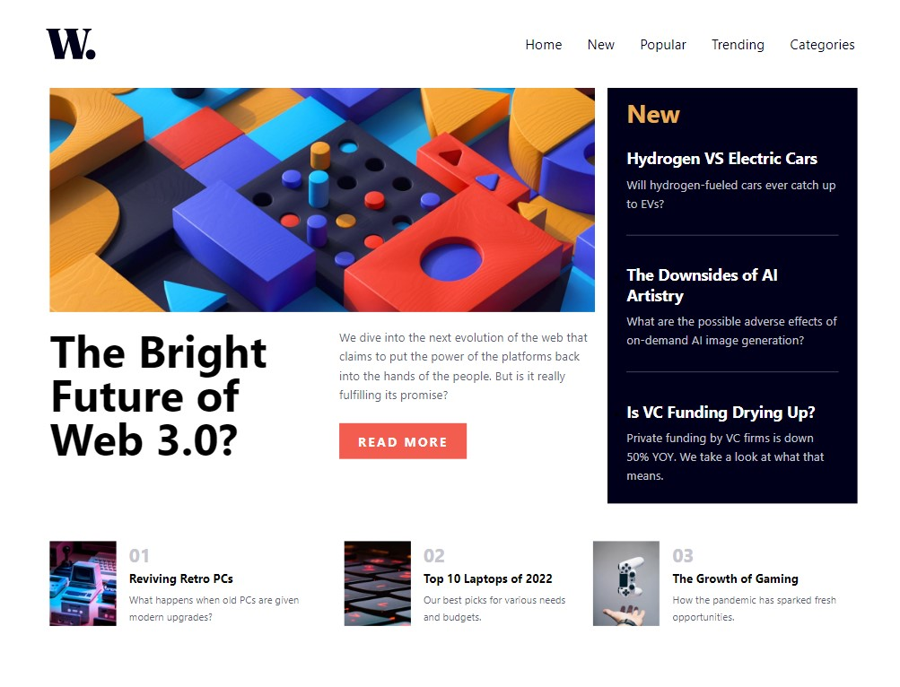
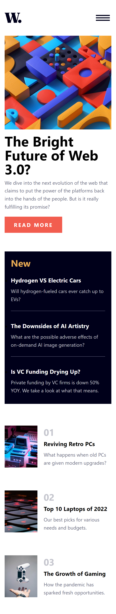
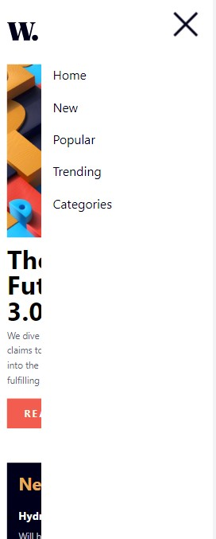

# Frontend Mentor - QR code component solution

This is a solution to the [QR code component challenge on Frontend Mentor](https://www.frontendmentor.io/challenges/qr-code-component-iux_sIO_H). Frontend Mentor challenges help you improve your coding skills by building realistic projects. 

## Table of contents

- [Overview](#overview)
  - [Screenshot](#screenshot)
  - [Links](#links)
- [My process](#my-process)
  - [Built with](#built-with)
  - [What I learned](#what-i-learned)
  - [Continued development](#continued-development)
  - [Useful resources](#useful-resources)
- [Author](#author)

## Overview

### Screenshot





### Links

- Solution URL: [Add solution URL here](https://github.com/AnakonStar/news-homepage-main)
- Live Site URL: [Add live site URL here](https://anakonstar.github.io/news-homepage-main/)

## My process

### Built with

- Basic Javascript functions to changes CSS styles
- Semantic HTML
- CSS

### What I learned

Some peculiarities of each screen type, such as when you switch to desktop view, it shows a list of links within the page, but when you view it as mobile, it will shows a menu button that opens a drawer for you to navigate between the sections. All of this can be done with CSS ```@media-screen``` and Javascript, using the display as the medium.

Like the example below:

```
Mobile

nav {
  background-color: #FFF;
  position: absolute;
  margin: 0;
  padding: 0;
  right: 0;
  top: 0;
  height: 100vh;
  width: 80%;
  z-index: 100;
  display: none;

  transition: 0.5s ease;
}

Desktop

nav {
  background-color: transparent;
  position: relative;
  margin: 0;
  padding: 0;
  height: auto;
  display: flex;
  width: auto;
}

Javascript

function openNav() {
  document.getElementById("sideNav").style.display = "flex";
}

function closeNav() {
  document.getElementById("sideNav").style.display = "none";
}
```

Note that the display changes between screens, and then just apply a style to it in Javascript, just by using the two functions ```openNav``` and ```closeNav```, that are currently being called by the menu button in html:

```
...

<button onclick="openNav()">
  
</button>

...

<button onclick="closeNav()">
  
</button>

...
```

And just like that, you've a functional drawer that simply turns into a header browser, when switch to desktop view!

### Continued development

- Learn more about the changes between screen view types, to do more responsive and organized websites, to any screen view
- Learn more about how to use Javascript at websites projects

### Useful resources

In this project, I only used my basics knowledge of each language, such as:

- document function calling id or class, from HTML to be used in Javascript;
- @media-screen that I've learned from other projects in Front-End Mentor;
- The display states, like: none, flex, inline...;
- Semantic HTML for organization.
- Specific the ```picture``` tag, that can be used to change the image depending on the screen size

## Author

- LinkedIn - [Enzo Santana](https://www.your-site.com)
- GitHub - [AnakonStar](https://github.com/AnakonStar)
- Frontend Mentor - [@AnakonStar](https://www.frontendmentor.io/profile/AnakonStar)
- Workana - [Enzo Santana](https://www.workana.com/freelancer/4c2cdd8b9e92d8b32763edc91d6cde18)
